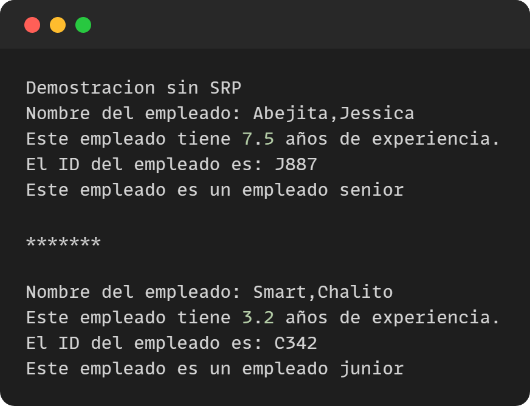
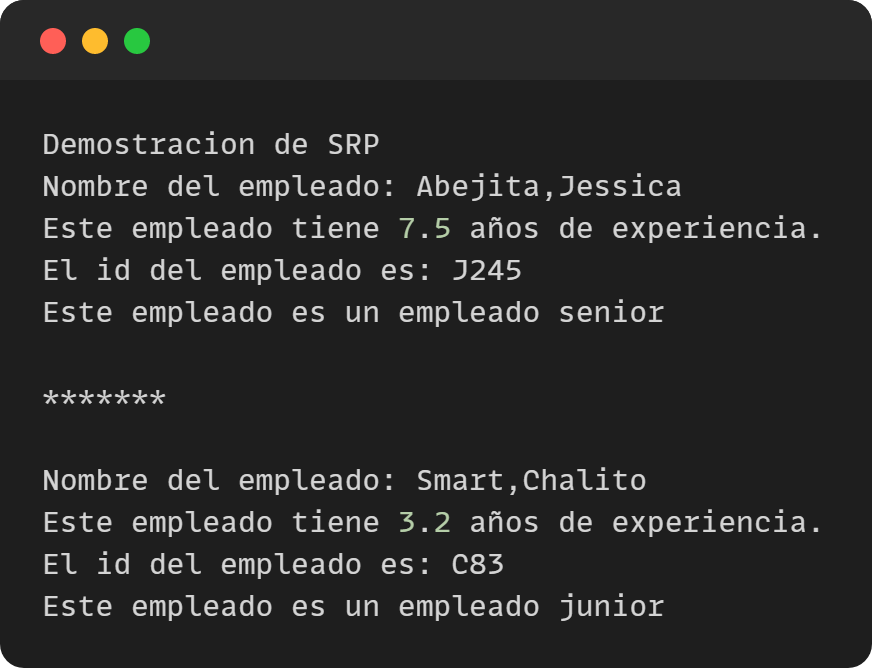

Single Responsability Principle (SRP)

**Demostración sin SRP**

**¿Cuál es el problema con este diseño?**

La clase Empleado tiene dos responsabilidades distintas, mostrar los detalles del empleado y generar el ID del empleado. En el método generateEmpId, estás generando el ID del empleado, pero también está actualizando el estado de la instancia de Empleado.

**Demostración con SRP**

**Explicación de resultados**

- La clase Cliente es la que se encarga de crear instancias de Empleado y llamar al método showEmpDetail para mostrar los detalles del empleado, generar el ID del empleado y verificar su nivel laboral. 
- El método showEmpDetail llama a diferentes clases para realizar estas tareas.
- La clase Empleado solo se encarga de almacenar la información del empleado, como el nombre, el apellido y los años de experiencia. 
- La clase GeneradorIDEmpleado se encarga de generar el ID del empleado 
- La clase SeniorityChecker se encarga de verificar el nivel laboral del empleado.
