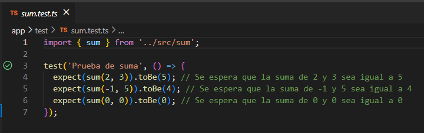
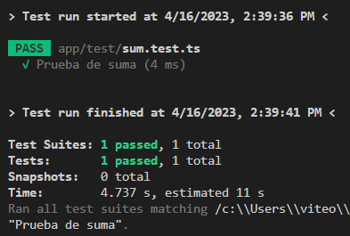
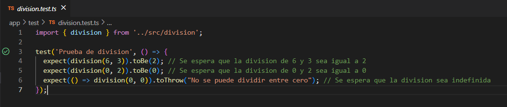
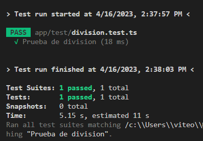

# Sprint 0
**1.	Decisiones claves para el proyecto SOS of the SOS**
| Categoría | Recomendación |
|---|---|
| Lenguaje de programación orientado a objetos | TypeScript | 
| Librería GUI | React | 
| IDE (Integrated Development Environment) | Visual Studio Code |
| Framework  xUnit | Jest |
| Guía de estilo de programación | Google TypeScript Style Guide
| Sitio de alojamiento del proyecto | GitHub |

La guia de estilos que utilizaremos sera:
`https://google.github.io/styleguide/tsguide.html`

**2.	Pruebas unitarias**

Test Suma

Test Division

**3.	Programación GUI**
