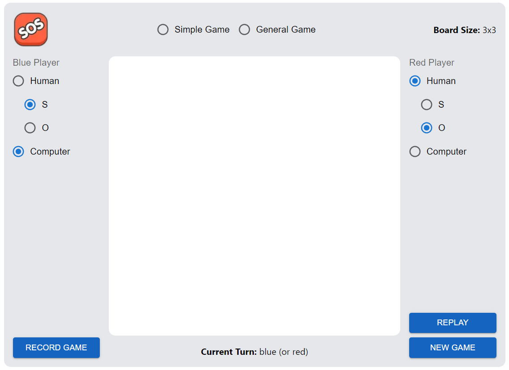

# Sprint 0
## Decisiones claves para el proyecto SOS of the SOS
| Categoría | Recomendación |
|---|---|
| Lenguaje de programación orientado a objetos | TypeScript | 
| Librería GUI | React | 
| IDE (Integrated Development Environment) | Visual Studio Code |
| Framework  xUnit | Jest |
| Guía de estilo de programación | Google TypeScript Style Guide
| Sitio de alojamiento del proyecto | GitHub |

La guia de estilos que utilizaremos sera:
`https://google.github.io/styleguide/tsguide.html`

## Pruebas unitarias

**Función Suma**

```typescript
 * @param a Primer número a sumar.
 * @param b Segundo número a sumar.
 * @returns Resultado de la suma.
 
export function sum(a: number, b: number): number {
  return a + b;
}
```
**Test Suma**

```typescript
import { sum } from '../src/sum';

test('Prueba de suma', () => {
  expect(sum(2, 3)).toBe(5); // Se espera que la suma de 2 y 3 sea igual a 5
  expect(sum(-1, 5)).toBe(4); // Se espera que la suma de -1 y 5 sea igual a 4
  expect(sum(0, 0)).toBe(0); // Se espera que la suma de 0 y 0 sea igual a 0
});
```
**Resultado Test Suma**


**Función División**

```typescript
 * @param a Dividendo.
 * @param b Divisor.
 * @returns Resultado de la division.
 
export function division(a: number, b: number): number {
    if (b === 0) {
        throw new Error("No se puede dividir entre cero");
      }
      return a / b;
  }
```

**Test División**

```typescript
import { division } from '../src/division';

test('Prueba de division', () => {
  expect(division(6, 3)).toBe(2); // Se espera que la division de 6 y 3 sea igual a 2
  expect(division(0, 2)).toBe(0); // Se espera que la division de 0 y 2 sea igual a 0
  expect(() => division(0, 0)).toThrow("No se puede dividir entre cero"); // Se espera que la division sea indefinida
});
```
**Resultado Test División**


## Programación GUI


