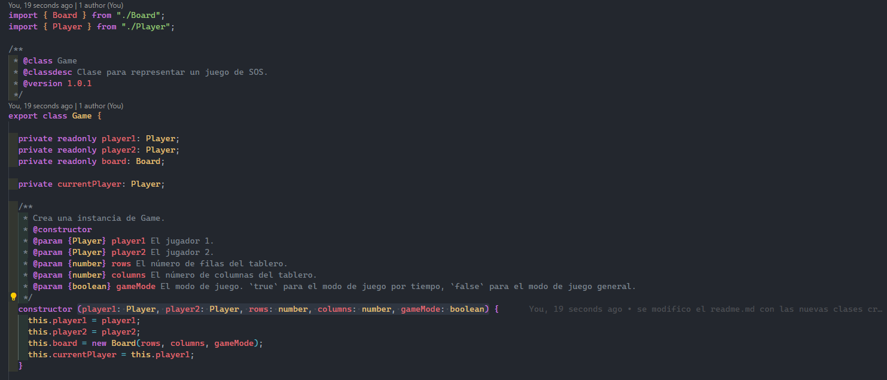

# Sprint 2

## Resumen del código fuente

| Nombre del archivo o código fuente | ¿Código de producción o de prueba? | # Lineas de código |
|---|---|---|
| Board.ts |  |94 |
| Game.ts |  | 66 |
| Player.ts |  | 56 |
| Score.ts |  | 42 |

## Código de producción vs Historias de Usuario/Criterio de Aceptación

| Nombre e ID de historia de usuario | AC ID | Nombre Clase(s) | Nombre Método(s) | Estatus (completo o no) | Notas (opcional) |
|---|---|---|---|---|---|
| 1. Escoge el tamaño del tablero | 1.1 | Board | Board(rows, columns, gameMode) | completo | - |
| 2. Escoge el modo de juego de un tablero escogido | 2.1 | Board| Board(rows, columns, gameMode) | completo | - |
| 3. Comienza un nuevo juego del tamaño de tablero y del modo de juego elegidos  | 3.1 | Player, Game | Game(player1, player2, rows, columns, gameMode) | completo | - |
| 4. Hacer un movimiento en un juego simple | 4.1 | Player, Board, Game | makeMove(board, rows, column, letter) | completo | - |
| 5. Un juego simple a terminado | 5.1 | Player Score | checkResult getScore | incompleto | - |

## Pruebas vs Historias de Usuario/Criterio de Aceptación

**1. Pruebas automatizadas que corresponden directamente a los criterios de aceptación**

| Nombre e ID de historia de usuario | AC ID | Nombre Clase(s) del código de prueba | Nombre Método(s) del código de prueba | Descripción de los casos de prueba (entrada & salida esperada) |
|---|---|---|---|---|
| 1. Escoge el tamaño del tablero | 1.1 | board.test | expect(board.getRows()).toBe(rows) expect(board.getColumns()).toBe(columns)| completo | - |
| 2. Escoge el modo de juego de un tablero escogido | 2.1 | board.test | expect(board.getGameMode()).toBe(gameMode); | completo | - |
| 3. Comienza un nuevo juego del tamaño de tablero y del modo de juego elegidos  | 3.1 | player.test | expect(board.getRows()).toBe(rows) expect(board.getColumns()).toBe(columns) expect(board.getGameMode()).toBe(gameMode) | incompleto | - |
| 4. Hacer un movimiento en un juego simple | 4.1 | player.test | expect(boardState).toBe([1][1])  | completo | - |
| 5. Un juego simple a terminado | 5.1 | Player Score | expect(gameState).toBe(finished) | incompleto | - |

**2. Pruebas manuales que corresponden directamente a los criterios de aceptación**

| Nombre e ID de historia de usuario | AC ID | Entrada de caso de prueba | Salida esperada | Notas |
|---|---|---|---|---|
| 1. Escoge el tamaño del tablero | 1.1 |  | | | 
| 2. Escoge el modo de juego de un tablero escogido | 2.1 |  | | | 
| 3. Comienza un nuevo juego del tamaño de tablero y del modo de juego elegidos  | 3.1 |  | | | 
| 4. Hacer un movimiento en un juego simple | 4.1 |  | | | 
| 5. Un juego simple a terminado | 5.1 |  | | | 
