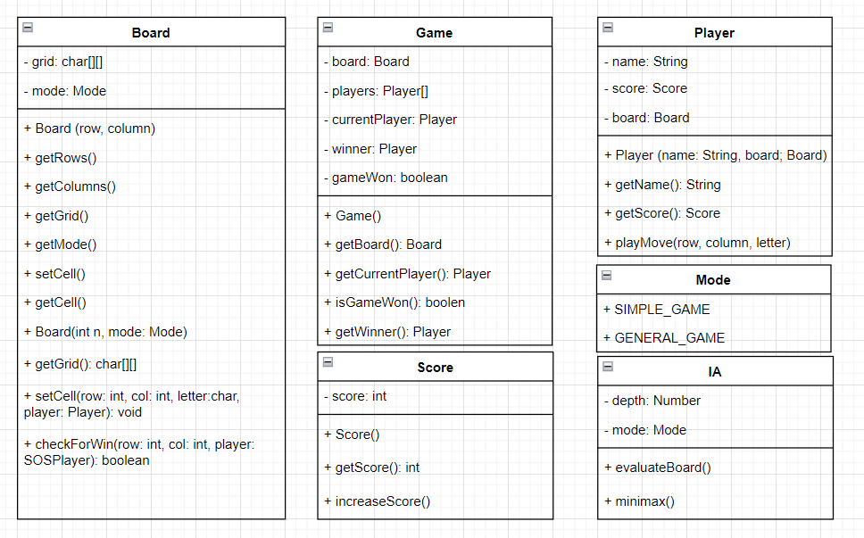

# Sprint 4

## Historias de usuario para los requisitos del oponente de la computadora

|ID| Nombre de Historia de Usuario | Descripción de Historia de Usuario | Prioridad | Esfuerzo Estimado |
|---|---|---|---|---|
| 1| Estrategia única y variada| Como jugador, quiero que la oponente de la computadora tenga una estrategia única y variada, para que cada partida sea diferente y emocionante.| Alta | 6h | 
| 2 | Errores controlados |Como jugador, quiero que la oponente de la computadora cometa errores de vez en cuando, para que tenga la oportunidad de ganar y no siempre perder.  | Baja | 3h | 
| 3 | Respuesta rápida |Como jugador, quiero que la oponente de la computadora responda rápidamente a mis movimientos, para que la experiencia de juego sea fluida y no haya retrasos. | Media| 4h| 
| 4 | Comportamiento justo y ético| Como jugador, quiero que la oponente de la computadora tenga un comportamiento justo y ético, para que la experiencia de juego sea justa y equitativa para ambos jugadores.| Bajo | 4h | 

## Resumen de todo el código fuente

|Nombre del archivo de código fuente| Código de producción o de prueba | # Líneas de código | 
|---|---|---|
| Board.ts | Producción | 134 |
| Difficulty.ts | Producción | 26 |
| Game.ts| Producción | 126 |
| IA.ts| Producción | 47 |
| Letter.ts| Producción | 25 | 
| Mode.ts | Producción | 19 | 
| Movement.ts| Producción | 104 | 
| Player.ts | Producción |57 | 
| Score.ts | Producción |45 |
| board.test.ts | Prueba | 78 | 
| game.test.ts | Prueba | 119 | 
| ia.test.ts | Prueba | 40 | 
| player.test.ts | Prueba | 56 | 

## Código de producción vs Nuevas historias de usuario/Criterios de aceptación

|ID y Nombre de Historia de Usuario| AC ID | Nombres clases | Nombres métodos | Estado |
|---|---|---|---|---|
|1. Estrategia única y variada | 1.1 | Game Board| makeMove() checkSOS()| completo|  
| 2. Errores controlados| 2.1 | Game | makeMove() | incompleto| 
|3. Respuesta rápida | 3.1 | Game Board |makeMove() getCurrentPlayer() getGameOver() setPoints()| completo |  
|4. Comportamiento justo y ético | 4.1 | Game Mode Player | makeMove() getWinner() getGameOver()| incompleto |  

## Pruebas vs Nuevas historias de usuario/Criterio de aceptación
**Pruebas automatizadas**
|ID y Nombre de Historia de Usuario| AC ID | Entrada de caso de prueba | Salida esperada | 
|---|---|---|---|
|1. Estrategia única y variada | 1.1 | | | 
|2. Errores controlados| 2.1 | | | 
|3. Respuesta rápida | 3.1 | | |  
|4. Comportamiento justo y ético | 4.1 | | |  

## Diagrama de clases del código en producción y jerarqía de clases en el diseño 

### Clase principal: Game
Tomamos la clase game como principal, esta clase se encarga de recibir de paramatro el tablero y los jugadores en su constructor, además de tener los métodos que se encargan de hacer el juego, como por ejemplo:

- setCurrentPlayer(player): Este método se encarga de cambiar el jugador actual, recibe como parámetro el jugador que va a ser el actual.

- getWinner(): Este método se encarga de retornar el ganador del juego, si no hay ganador retorna un error Draw.

### Clase Board

Esta clase se encarga de crear el tablero, se encarga de asignar el número de filas y columnas, ademas recibe como parámetro el modo de juego, el cual puede ser simple o general.

Esta clase contiene métodos como:

- getRows(): Este método se encarga de retornar el número de filas del tablero.

- getColumns(): Este método se encarga de retornar el número de columnas del tablero.

- getMode(): Este método se encarga de retornar el modo de juego del tablero.

- getCell(x,y): Este método se encarga de retornar la celda del tablero en la posición x,y.

- setCell(x,y,cell): Este método se encarga de asignar la celda del tablero en la posición x,y.

- checkSOS(): Este método se encarga de verificar si se ha formado un SOS en el tablero, retorna true si se ha formado un SOS, de lo contrario retorna false.

### Clase Player

Esta clase se encarga de crear los jugadores, recibe como parámetro el nombre del jugador.

Esta clase contiene métodos como:

- getName(): Este método se encarga de retornar el nombre del jugador.

- makeMove(x,y,str): Este método se encarga de hacer el movimiento del jugador, recibe como parámetro la posición x,y y la letra que va a colocar en la posición.

### Clase Score

Esta clase se encarga de llevar el puntaje de los jugadores.

Esta clase contiene métodos como:

- getScore(): Este método se encarga de retornar el puntaje del jugador.

- addScore(score): Este método se encarga de asignar el puntaje del jugador.

### Clase Mode

Esta clase enum se encarga de definir los modos de juego, los cuales son simple y general.

### Clase Letter

Esta clase se encarga de definir las letras a usar en el juego, es decir "S" u "O"

### Clase IA

Esta clase se encarga de programar la inteligencia de la computadora al momento de juggar contra esta.

