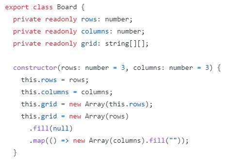
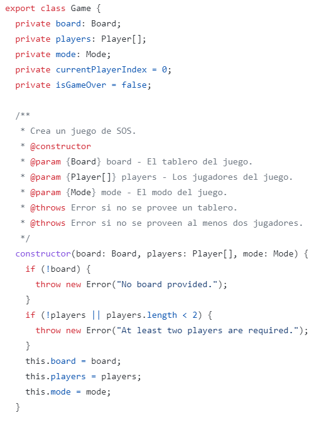
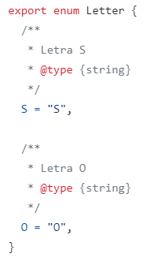
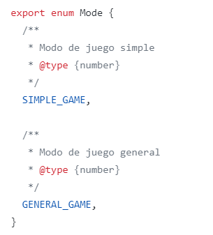
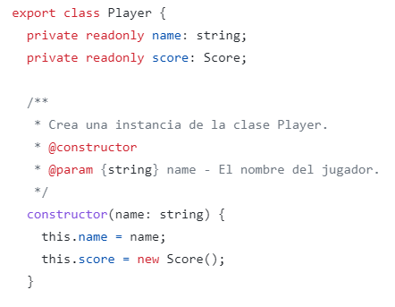
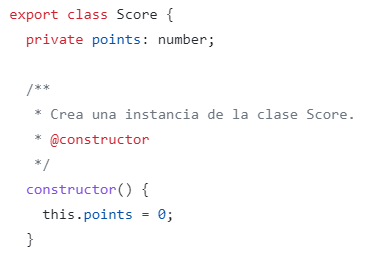

# Sprint 4

## Historias de usuario para los requisitos del oponente de la computadora

|ID| Nombre de Historia de Usuario | Descripción de Historia de Usuario | Prioridad | Esfuerzo Estimado |
|---|---|---|---|---|
| 1| Estrategia única y variada| Como jugador, quiero que la oponente de la computadora tenga una estrategia única y variada, para que cada partida sea diferente y emocionante.| Alta | 6h | 
| 2 | Errores controlados |Como jugador, quiero que la oponente de la computadora cometa errores de vez en cuando, para que tenga la oportunidad de ganar y no siempre perder.  | Baja | 3h | 
| 3 | Respuesta rápida |Como jugador, quiero que la oponente de la computadora responda rápidamente a mis movimientos, para que la experiencia de juego sea fluida y no haya retrasos. | Media| 4h| 
| 4 | Comportamiento justo y ético| Como jugador, quiero que la oponente de la computadora tenga un comportamiento justo y ético, para que la experiencia de juego sea justa y equitativa para ambos jugadores.| Bajo | 4h | 

## Resumen de todo el código fuente

|Nombre del archivo de código fuente| Código de producción o de prueba | # Líneas de código | 
|---|---|---|
|Board.ts | | | 
| Game.ts| | | 
| Letter.ts| | | 
| Mode.ts| | | 
|Player.ts | | | 
|Score.ts | | | 

## Código de producción vs Nuevas historias de usuario/Criterios de aceptación

|ID y Nombre de Historia de Usuario| AC ID | Nombres clases | Nombres métodos | Estado |
|---|---|---|---|---|
|1. Estrategia única y variada | 1.1 | Game Board| makeMove() checkSOS()| completo|  
| 2. Errores controlados| 2.1 | Game | makeMove() | incompleto| 
|3. Respuesta rápida | 3.1 | Game Board |makeMove() getCurrentPlayer() getGameOver() setPoints()| completo |  
|4. Comportamiento justo y ético | 4.1 | Game Mode Player | makeMove() getWinner() getGameOver()| incompleto |  

## Pruebas vs Nuevas historias de usuario/Criterio de aceptación
**Pruebas automatizadas**
|ID y Nombre de Historia de Usuario| AC ID | Entrada de caso de prueba | Salida esperada | 
|---|---|---|---|
|1. Estrategia única y variada | 1.1 | | | 
| 2. Errores controlados| 2.1 | | | 
|3. Respuesta rápida | 3.1 | | |  
|4. Comportamiento justo y ético | 4.1 | | |  

**Pruebas manuales**

## Diagrama de clases del código en producción y jerarqía de clases en el diseño 

